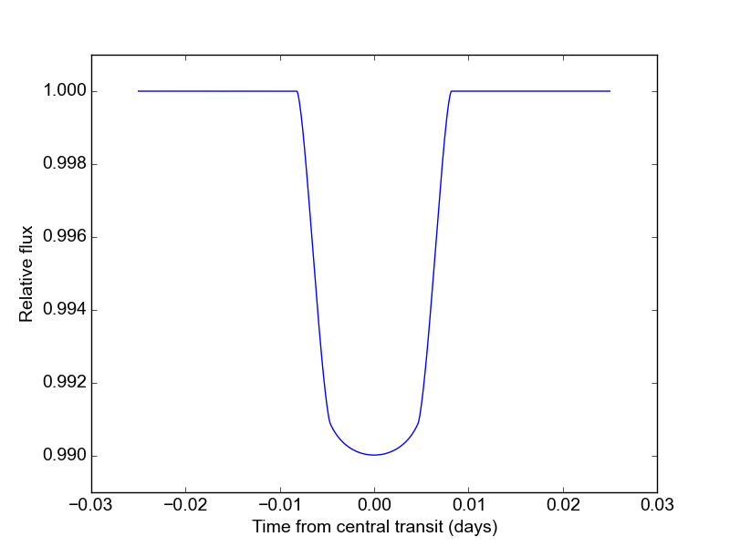

.. _quickstart:

Quickstart
============
If you're in a hurry to model some awesome transits, you're on the right page.  Here's an example of basic ``batman`` usage to calculate a model light curve with quadratic limb darkening.  (For more detailed examples, check out the :ref:`tutorial`!)

First, we import ``batman``:

::

	import batman

Next we create a ``TransitParams`` object to store the physical parameters describing the transit:

::

	params = batman.TransitParams()
	params.t0 = 0. 				#time of periastron passage (for eccentric orbits), OR
						#mid-transit time (for circular orbits)
	params.per = 1.				#orbital period	
	params.rp = 0.1				#planet radius (in units of stellar radii)
	params.a = 15.				#semi-major axis (in units of stellar radii)
	params.inc = 87.			#orbital inclination (in degrees)	
	params.ecc = 0.				#eccentricity	
	params.w = 90.				#longitude of periastron (in degrees)
	params.u = [0.1, 0.3] 	      	        #limb darkening coefficients
	params.limb_dark = "quadratic"          #limb darkening model

Note that for circular orbits, the time of periastron is undefined, so for this case ``params.t0`` refers to the time of central transit.  The units for ``params.t0`` and ``params.per`` can be anything as long as they are consistent.

We also need to specify the times at which we wish to calculate the model:

::

	t = np.linspace(-0.05, 0.05, 100)    	#times at which to calculate light curve	

Using these parameters, we initialize the model and calculate a model light curve: 

::

	m = batman.TransitModel(params, t)      #initializes model
	flux = m.LightCurve(params)	        #calculates light curve

Voilà!  Here's a figure showing the light curves:

::

	plt.plot(t, flux)
	plt.plot(t, new_flux)
	plt.xlabel("Time from central transit")
	plt.ylabel("Relative flux")
	plt.show()

This code is available in full at https://github.com/lkreidberg/batman/tree/master/docs/quickstart.py.

