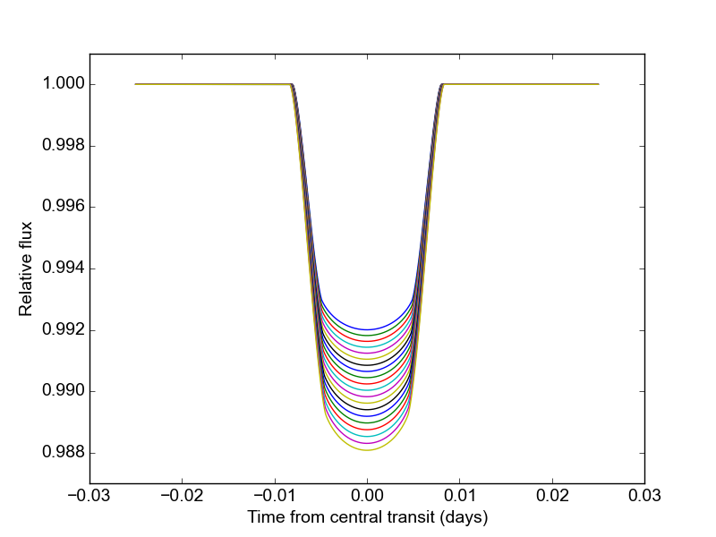
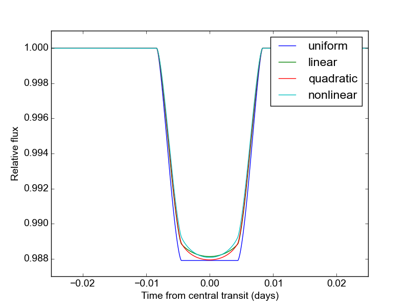
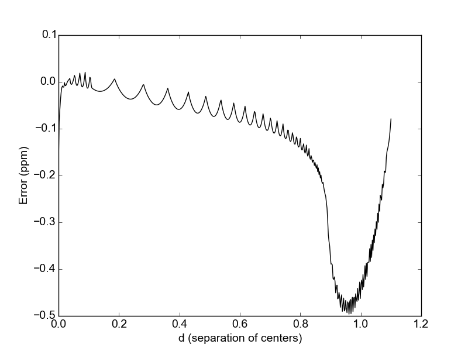

.. _tutorial:

Tutorial
============
In this tutorial, we'll go through ``batman``'s functionality in more detail than in the :ref:`quickstart`.  First let's initialize a model with nonlinear limb darkening:

Initializing the model
----------------------
::

	params = batman.TransitParams()	      #object to store transit parameters
	params.t0 = 0. 			      #time of periastron (for eccentric orbits), OR
					      #mid-transit time (for circular orbits)
	params.per = 1.			      #orbital period	
	params.rp = 0.1			      #planet radius (in units of stellar radii)
	params.a = 15.		              #semi-major axis (in units of stellar radii)
	params.inc = 87.	              #orbital inclination (in degrees)	
	params.ecc = 0.			      #eccentricity	
	params.w = 90.			      #longitude of periastron (in degrees) 
	params.limb_dark = "nonlinear"        #limb darkening model
   	params.u = [0.5, 0.1, 0.1, -0.1]      #limb darkening coefficients
	   
	t = np.linspace(-0.025, 0.025, 1000)  #times at which to calculate light curve	
	m = batman.TransitModel(params, t)    #initializes model

The initialization step calculates the separation of centers between the star and the planet, as well as the integration step size (for "square-root", "logarithmic", "exponential", "nonlinear", and "custom" limb darkening). 

Calculating light curves
------------------------------

To make a model light curve, we use the ``light_curve`` method: 

::

	flux = m.light_curve(params)	      		#calculates light curve

Now that the model has been set up, we can change the transit parameters and recalculate the light curve **without** reinitializing the model.  For example, we can make light curves for a range of planet radii like so:

::

	radii = np.linspace(0.09, 0.11, 20)
	for r in radii:
		params.rp = r		        	#updates planet radius
		new_flux = m.light_curve(params)  	#recalculates light curve

Limb darkening options
----------------------
The ``batman`` package currently supports the following pre-defined limb darkening options: "uniform", "linear", "quadratic", "square-root", "logarithmic", "exponential", and "nonlinear".  These options assume the following form for the stellar intensity profile:

.. math::

	\begin{align}
	  I(\mu) &= I_0                            						& &\text{(uniform)} 		\\
	  I(\mu) &= I_0[1 - c_1(1-\mu)]								& &\text{(linear)}		\\
	  I(\mu) &= I_0[1 - c_1(1 - \mu) - c_2(1-\mu)^2]	 				& &\text{(quadratic)}		\\
  	  I(\mu) &= I_0[1 - c_1(1 - \mu) - c_2(1-\sqrt{\mu})]                                   & &\text{(square-root)}         \\
  	  I(\mu) &= I_0[1 - c_1(1 - \mu) - c_2\mu\ln{\mu}]                                      & &\text{(logarithmic)}         \\
  	  I(\mu) &= I_0\left[1 - c_1(1 - \mu) - c_2/(1-\exp{\mu})\right]                  	& &\text{(exponential)}         \\
	  I(\mu) &= I_0[1 - c_1(1-\mu^{1/2}) - c_2(1- \mu) - c_3(1-\mu^{3/2}) - c_4(1-\mu^2)]  	& &\text{(nonlinear)}				
	\end{align}

where :math:`\mu = \sqrt{1-x^2}, 0 \le x \le 1` is the normalized radial coordinate and :math:`I_0` is a normalization constant such that the integrated stellar intensity is unity.

To illustrate the usage for these different options, here's a calculation of light curves for the four most common profiles:

::

	ld_options = ["uniform", "linear", "quadratic", "nonlinear"]
	ld_coefficients = [[], [0.3], [0.1, 0.3], [0.5, 0.1, 0.1, -0.1]]

	plt.figure()

	for i in range(4):
		params.limb_dark = ld_options[i]          #specifies the LD profile
		params.u = ld_coefficients[i]	          #updates LD coefficients
		m = batman.TransitModel(params, t)	  #initializes the model
		flux = m.light_curve(params)		  #calculates light curve
		plt.plot(t, flux, label = ld_options[i])

The limb darkening coefficients are provided as a list of the form :math:`[c_1, ..., c_n]` where :math:`n` depends on the limb darkening model. 

Custom limb darkening
---------------------
``batman`` also supports the definition of custom limb darkening.  To create a custom limb darkening law, you'll have to write a very wee bit of C code and perform a new installation of ``batman``. 

First, download the package from source at https://pypi.python.org/pypi/batman-package/.  Unpack the files and ``cd`` to the root directory.

To define your stellar intensity profile, edit the ``intensity`` function in the file ``c_src/_custom_intensity.c``.  This function returns the intensity at a given radial value, :math:`I(x)`.  Its arguments are :math:`x` (the normalized radial coordinate; :math:`0\le x \le 1`) and six limb darkening coefficients, :math:`c_1, ..., c_6`. 

The code provides an example intensity profile to work from:

.. math::

	I(x)  = I_0\left[1 - c_1(1 - \sqrt{1-x^2}) - c_2\ln{\left(\frac{\sqrt{1-x^2}+c_3}{1 + c_3}\right)}\right]

(N.B.: This profile provides a better fit to stellar models than the quadratic law, but uses fewer coefficients than the nonlinear law. Thanks to Eric Agol for suggesting it!).

This function can be replaced with another of your choosing, so long as it satistifies the following conditions:

- The integrated intensity over the stellar disk must be unity: 

.. math::

	\int_0^{2\pi} \int_0^1 I(x)x dx d\theta = 1

- The intensity must also be defined on the interval :math:`0\le x \le 1`.  To avoid issues relating to numerical stability, I would recommend including::

	if(x < 0.00005) x = 0.00005;
	if(x > 0.99995) x = 0.99995;

To re-install ``batman`` with your custom limb darkening law, run the setup script:

::

	$ sudo python setup.py install

You'll have to ``cd`` out of the source root directory to successfully import ``batman``.  Now, to calculate a model light curve with your custom limb darkening profile, use:

::

	params.limb_dark = "custom"
	params.u = [c1, c2, c3, c4, c5, c6]

with any unused limb darkening coefficients set equal to 0.

And that's it!

Error tolerance
---------------
For models calculated with numeric integration ("square-root", "logarithmic", "exponential", "nonlinear" and "custom" profiles), we can specify the maximum allowed truncation error with the ``max_err`` parameter:  

::

  m = batman.TransitModel(params, t, max_err = 0.5)

This initializes a model with a step size tuned to yield a maximum truncation error of 0.5 ppm.  The default ``max_err`` is 1 ppm, but you may wish to adjust it depending on the combination of speed/accuracy you require.  Changing the value of ``max_err`` will not impact the output for the analytic models ("quadratic", "linear", and "uniform").

To validate that the errors are indeed below the ``max_err`` threshold, we can use ``m.calc_err()``.  This function returns the maximum error (in ppm) over the full range of separation of centers :math:`d` (:math:`0 \le d \le 1`, in units of rs).  It also has the option to plot the truncation error over this range:

::

  err = m.calc_err(plot = True) 

Truncation error is larger near :math:`d = 1` because the stellar intensity has a larger gradient near the limb.

If you prefer not to calculate the step size automatically, it can be set explicitly with the ``fac`` parameter; this saves time during the model initialization step.

Parallelization
---------------
The default behavior for ``batman`` is no parallelization.  If you want to speed up the calculation, you can parallelize it by setting the
``nthreads`` parameter.  For example, to use 4 processors you would initialize a model with:

::

	m = batman.TransitModel(params, t, nthreads = 4)

The parallelization is done at the C level with OpenMP.  If your default C compiler does not support OpenMP, ``batman`` will raise an exception if you specify ``nthreads``>1. 

.. note::
	Mac users: the C default compiler (clang) does not currently (06/2015) support OpenMP. To use a different compiler, perform a fresh install with the "CC" and "CXX" environment variables set inside "setup.py" with os.environ. 

